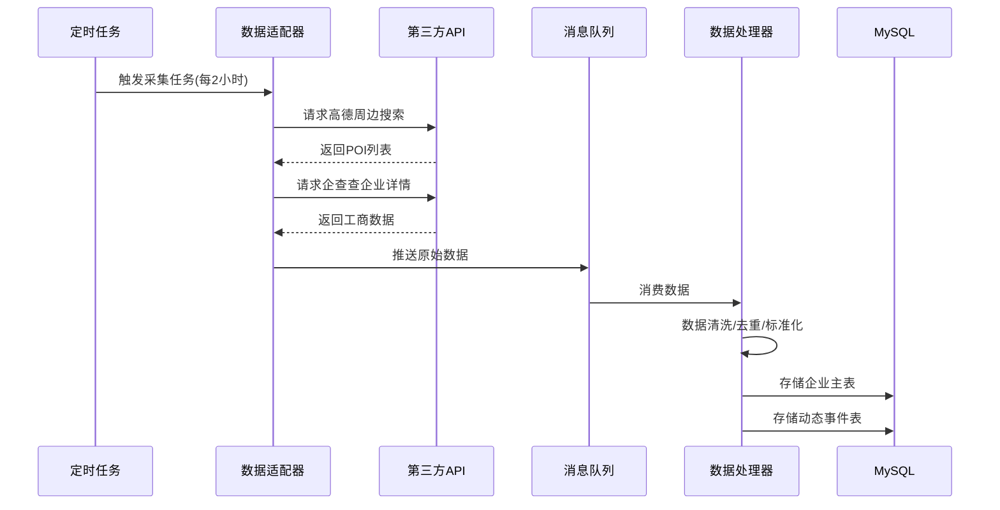
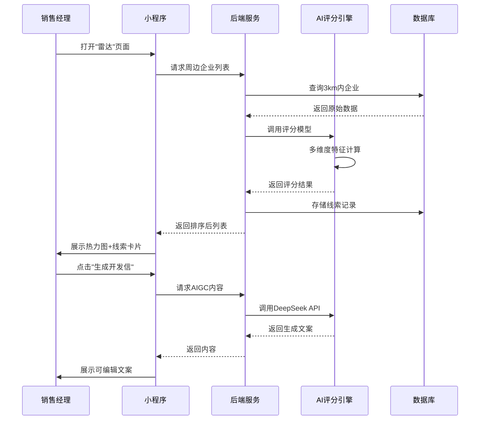

# SKILL-PRD-001: 主动雷达获客 (Active Radar Lead Hunting)

## 基本信息

| 字段 | 内容 |
|------|------|
**SKILL编号** | GRW-013
**SKILL名称** | 主动雷达获客 (Active Radar Lead Hunting)
**所属AGENT** | 营销增长AGENT (Growth Agent)
**版本** | v1.0
**创建日期** | 2026-03-04
**优先级** | P0 (核心差异化能力)
**开发周期** | 4-6周

---

## 1. 价值定位

### 1.1 解决的问题
传统酒店销售依赖"被动等待"客户上门或OTA导流，面临：
- 获客成本高：OTA佣金20-30%，协议客开发依赖人工扫楼
- 覆盖范围窄：销售人力有限，难以全面覆盖周边3-5km商务生态
- 商机发现滞后：企业扩张/展会活动/婚庆需求等信号无法及时捕捉
- 转化效率低：线索质量参差，缺乏科学的评分筛选机制

### 1.2 核心价值
**"让销售从狩猎者变为精准狙击手"**
- 自动扫描酒店周边3-5km企业生态，24小时不间断发现潜在线索
- 多维度数据融合（工商/展会/社交），智能评估差旅/宴会潜力
- AI生成个性化开发内容，一键触达关键决策人
- 预期效果：新客开发效率提升300%+，销售人均产出增长150%

### 1.3 商业模式
- **订阅制**：酒店按年付费使用SaaS工具
- **效果分成**：成功签约协议客户后抽取3-5%服务费
- **增值服务**：联系人补全、AI代写开发信等按次计费

---

## 2. 目标用户

### 2.1 主要用户
| 用户角色 | 使用场景 | 核心痛点 |
|---------|---------|---------|
**销售总监** | 查看团队获客漏斗，分配高价值线索 | 不知道销售每天拜访了谁，线索质量无法评估 |
**销售经理** | 每天打开小程序，获取今日推荐线索 | 盲目扫楼效率低，不知道哪些企业有真实需求 |
**宴会销售** | 监控展会/婚庆意向信号 | 错过本地展会商机，婚庆客户被竞品提前截胡 |
**收益经理** | 评估周边竞争态势 | 不了解周边企业规模和差旅需求密度 |

### 2.2 用户画像
**典型用户：张经理，35岁，商务酒店销售经理**
- 每天需要拜访5-8家企业，但80%是低效拜访
- 希望能"先知先觉"知道哪些企业即将产生差旅需求
- 不会写吸引人的开发信，经常被客户无视
- 抱怨"总是在追着客户跑，而不是客户来找我"

---

## 3. 功能架构

### 3.1 四层架构设计

```
┌─────────────────────────────────────────────────────────────┐
│                    应用层 (小程序前端)                        │
│  ┌─────────────┐ ┌─────────────┐ ┌─────────────┐            │
│  │ 雷达热力图   │ │ 线索列表    │ │ AIGC助手    │            │
│  │ 可视化展示   │ │ 详情+评分   │ │ 文案生成    │            │
│  └─────────────┘ └─────────────┘ └─────────────┘            │
└─────────────────────────────────────────────────────────────┘
                              ↕ API
┌─────────────────────────────────────────────────────────────┐
│                    AI分析层 (大脑)                           │
│  ┌─────────────┐ ┌─────────────┐ ┌─────────────┐            │
│  │ 实体识别NER  │ │ 线索评分模型 │ │ 意图解析LLM │            │
│  │ BERT-BiLSTM │ │ Lead Scoring│ │ DeepSeek    │            │
│  └─────────────┘ └─────────────┘ └─────────────┘            │
└─────────────────────────────────────────────────────────────┘
                              ↕ Kafka
┌─────────────────────────────────────────────────────────────┐
│                    数据感知层 (数据采集)                      │
│  ┌─────────────┐ ┌─────────────┐ ┌─────────────┐            │
│  │ 地理围栏API │ │ 工商数据API │ │ 展会数据API │            │
│  │ 高德地图    │ │ 企查查      │ │ 10times     │            │
│  └─────────────┘ └─────────────┘ └─────────────┘            │
│  ┌─────────────┐ ┌─────────────┐                            │
│  │ 社交媒体爬虫│ │ 招投标API   │                            │
│  │ 抖音/小红书 │ │ 采招网      │                            │
│  └─────────────┘ └─────────────┘                            │
└─────────────────────────────────────────────────────────────┘
                              ↕ SQL
┌─────────────────────────────────────────────────────────────┐
│                    数据存储层                                │
│  ┌─────────────┐ ┌─────────────┐ ┌─────────────┐            │
│  │ MySQL       │ │ Redis       │ │ Elasticsearch│            │
│  │ 结构化数据  │ │ 缓存/会话   │ │ 全文检索    │            │
│  └─────────────┘ └─────────────┘ └─────────────┘            │
└─────────────────────────────────────────────────────────────┘
```

### 3.2 核心功能模块

#### 模块1: 雷达扫描引擎

**功能描述**
以酒店为圆心，自动扫描周边3-5km范围内的企业、展会、社交信号。

**数据源**
| 数据源 | 数据类型 | 更新频率 | API成本 |
|--------|---------|---------|---------|
| 高德地图 | 周边POI、企业位置 | 实时 | 免费额度+按量付费 |
| 企查查/天眼查 | 工商注册、注册资本、参保人数、行业分类、行政许可 | 每日 | ~0.1元/条 |
| 10times/Cvent | 展会排期、主办方、参展商 | 每周 | 免费+付费增值 |
| 抖音/小红书 | 带地理标签的视频/笔记 | 实时 | 自建爬虫 |
| 采招网 | 企业招投标信息 | 每日 | API订阅 |

**扫描范围配置**
```yaml
默认配置:
  半径: 3km (商务酒店) / 5km (度假酒店)
  行业筛选: ["科技", "金融", "医药", "制造", "专业服务"]
  规模筛选: 参保人数 > 50人
  注册资本: > 500万
  
高级配置:
  差旅强度信号:
    - 招聘关键词: ["出差", "差旅", "商务", "销售", "客户经理"]
    - 岗位数量: 出差相关岗位 > 5个
  会议需求信号:
    - 招聘岗位: ["行政", "前台", "会议服务"]
    - 近期活动: 有年会/发布会历史
```

#### 模块2: 线索评分模型

**评分公式**
```
总分 = Σ(权重i × 特征值i) × 时间衰减系数

权重配置:
┌────────────────────────────────────────────┐
│ 特征维度          │ 权重  │ 数据来源       │
├────────────────────────────────────────────┤
│ 距离酒店          │ 20%   │ 高德地图       │
│ 企业规模(参保人数) │ 15%   │ 企查查         │
│ 行业差旅强度      │ 20%   │ 行业模型       │
│ 近期招聘信号      │ 15%   │ 招聘网站       │
│ 融资/扩张信号     │ 15%   │ 新闻+工商变更  │
│ 展会/活动关联     │ 10%   │ 10times        │
│ 社交意向信号      │ 5%    │ 抖音/小红书    │
└────────────────────────────────────────────┘

时间衰减:
  - 融资/招聘信号: 3个月内100%, 6个月50%, 1年0%
  - 展会信号: 展前30天100%, 展后7天50%

评级标准:
  - A级(90-100分): 立即跟进
  - B级(70-89分): 本周拜访
  - C级(50-69分): 纳入培育池
  - D级(<50分): 定期监控
```

**AI模型**
- **NER实体识别**: BERT-BiLSTM-CRF模型，从企业官网/招聘页提取关键联系人
- **意图分类**: DeepSeek/GPT-4o，分析社交媒体内容判断购买意向
- **差旅强度模型**: 基于行业+规模+岗位构成的回归模型

#### 模块3: 可视化雷达地图

**功能设计**
```
小程序界面:
┌─────────────────────────────────────┐
│  🔍 搜索企业...      [筛选▼] [刷新] │
├─────────────────────────────────────┤
│                                     │
│     ┌───┐                          │
│    /     \    ← 热力图层            │
│   │  🏨  │      (红色=高密度)        │
│    \     /                         │
│     └───┘                          │
│                                     │
│  💡 今日推荐 (5)                    │
│  ┌─────────────────────────────┐   │
│  │ 🏢 XX科技  [A级] [3km]      │   │
│  │ 💰 融资: 5000万B轮 (2天前)  │   │
│  │ 📊 参保: 320人 | 行业: 科技 │   │
│  │ 👤 联系人: 行政总监 张女士  │   │
│  │ [生成开发信] [导航前往]      │   │
│  └─────────────────────────────┘   │
│                                     │
│  [线索库] [商机监控] [我的跟进]     │
└─────────────────────────────────────┘
```

**交互功能**
- 热力图缩放: 1km/3km/5km 三级切换
- 企业卡片点击: 展开详情(工商信息+评分构成+联系人)
- 筛选器: 按距离/行业/规模/评分/时间筛选
- 导航集成: 一键跳转高德/百度地图

#### 模块4: AIGC营销助手

**功能设计**
根据企业画像，自动生成个性化开发内容。

**生成场景**
| 场景 | 输入 | 输出 | 示例 |
|------|------|------|------|
差旅协议邀请 | 企业信息+评分特征 | 微信/邮件开发信 | "祝贺XX科技完成B轮融资...专为高速成长型企业设计的差旅协议..."
宴会方案 | 展会/活动信息 | 宴会策划书 | "针对贵司即将举办的年度发布会，我们准备了专属方案..."
小红书种草 | 酒店特色+目标客群 | 探店文案 | "在XX酒店举办年会是什么体验？300人场地+全息投影..."
朋友圈文案 | 今日拜访记录 | 销售朋友圈 | "今天拜访了XX科技的行政总监，发现他们正在扩张..."

**Prompt模板示例**
```
角色: 酒店销售专家
任务: 为{酒店名称}撰写一封给{企业名称}的差旅协议开发信
背景信息:
- 企业: {企业名称}, {行业}, {参保人数}人, {注册资本}
- 近期动态: {融资/招聘/扩张信息}
- 酒店优势: {距离优势/会议设施/协议价格}
要求:
1. 第一句点出对方近期动态(表示关注)
2. 第二句说明酒店与对方的匹配点
3. 第三句给出具体价值(价格/便利/服务)
4. 结尾给出明确的下一步行动(预约拜访/电话沟通)
5. 语气专业但有温度，不要过度推销
字数: 150-200字
```

#### 模块5: 商机监控引擎

**监控类型**
| 监控维度 | 监控内容 | 触发条件 | 推送方式 |
|---------|---------|---------|---------|
企业动态 | 工商变更、融资、搬迁 | 注册资本增加/新融资/地址变更 | 小程序通知+企微 |
招聘信号 | 新增差旅相关岗位 | 发布>5个出差相关岗位 | 每日汇总 |
展会商机 | 本地展会排期发布 | 3个月内展会，规模>500人 | 提前30天推送 |
社交意向 | 带坐标标签的内容 | 关键词匹配(备婚/会议/乔迁) | 实时推送 |
招投标 | 酒店/会议相关招标 | 新发布招标公告 | 实时推送 |

**推送策略**
```yaml
A级线索(90+分):
  推送: 立即
  渠道: 小程序通知 + 企业微信 + 短信
  内容: 完整企业画像+联系人+开发信草稿

B级线索(70-89分):
  推送: 每日9:00汇总
  渠道: 小程序通知 + 企业微信
  内容: 企业列表+核心信号

C级线索(50-69分):
  推送: 每周一汇总
  渠道: 小程序通知
  内容: 培育池更新
```

---

## 4. 数据流程

### 4.1 数据采集流程



### 4.2 线索生成流程



---

## 5. 技术实现

### 5.1 技术栈

| 层级 | 技术选型 | 说明 |
|------|---------|------|
**前端** | 微信小程序原生 | 雷达地图使用腾讯地图SDK
**后端** | Python + FastAPI | 高并发API服务
**数据库** | MySQL 8.0 | 主数据库，存储企业/线索/用户数据
**缓存** | Redis | 热点数据缓存，会话管理
**消息队列** | Apache Kafka | 数据采集异步处理
**搜索引擎** | Elasticsearch | 企业全文检索
**AI模型** | DeepSeek-V3 / GPT-4o | NER+意图理解+内容生成
**地图服务** | 高德地图API | 周边搜索+地理编码+导航
**工商数据** | 企查查API | 企业工商信息
**部署** | Kubernetes + Docker | 容器化部署，自动扩缩容

### 5.2 数据库设计

**核心表结构**

```sql
-- 企业主表
CREATE TABLE companies (
    id BIGINT PRIMARY KEY AUTO_INCREMENT,
    unified_code VARCHAR(50) UNIQUE COMMENT '统一社会信用代码',
    name VARCHAR(200) NOT NULL COMMENT '企业名称',
    industry VARCHAR(50) COMMENT '行业分类',
    scale VARCHAR(20) COMMENT '规模(参保人数区间)',
    registered_capital BIGINT COMMENT '注册资本(万元)',
    address VARCHAR(500) COMMENT '注册地址',
    longitude DECIMAL(10,7) COMMENT '经度',
    latitude DECIMAL(10,7) COMMENT '纬度',
    contact_phone VARCHAR(50) COMMENT '联系电话',
    website VARCHAR(200) COMMENT '官网',
    data_source VARCHAR(50) COMMENT '数据来源',
    created_at TIMESTAMP DEFAULT CURRENT_TIMESTAMP,
    updated_at TIMESTAMP ON UPDATE CURRENT_TIMESTAMP,
    INDEX idx_location (longitude, latitude),
    INDEX idx_industry (industry),
    INDEX idx_scale (scale)
) COMMENT='企业基础信息表';

-- 企业动态事件表
CREATE TABLE company_events (
    id BIGINT PRIMARY KEY AUTO_INCREMENT,
    company_id BIGINT NOT NULL,
    event_type VARCHAR(50) COMMENT '事件类型(funding/recruit/move等)',
    event_title VARCHAR(500) COMMENT '事件标题',
    event_content TEXT COMMENT '事件详情',
    event_date DATE COMMENT '事件日期',
    signal_strength INT COMMENT '信号强度(1-10)',
    source_url VARCHAR(500) COMMENT '来源链接',
    created_at TIMESTAMP DEFAULT CURRENT_TIMESTAMP,
    FOREIGN KEY (company_id) REFERENCES companies(id),
    INDEX idx_company_date (company_id, event_date)
) COMMENT='企业动态事件表';

-- 线索评分表
CREATE TABLE leads (
    id BIGINT PRIMARY KEY AUTO_INCREMENT,
    hotel_id BIGINT NOT NULL COMMENT '所属酒店',
    company_id BIGINT NOT NULL COMMENT '关联企业',
    score INT COMMENT '综合评分(0-100)',
    level CHAR(1) COMMENT '等级(A/B/C/D)',
    distance_m INT COMMENT '距离(米)',
    score_details JSON COMMENT '评分详情(各维度得分)',
    status VARCHAR(20) DEFAULT 'new' COMMENT '线索状态',
    assigned_to BIGINT COMMENT '分配给销售ID',
    follow_up_count INT DEFAULT 0 COMMENT '跟进次数',
    last_follow_up_at TIMESTAMP COMMENT '最后跟进时间',
    created_at TIMESTAMP DEFAULT CURRENT_TIMESTAMP,
    FOREIGN KEY (company_id) REFERENCES companies(id),
    INDEX idx_hotel_score (hotel_id, score),
    INDEX idx_status (status)
) COMMENT='销售线索表';

-- 联系人表
CREATE TABLE contacts (
    id BIGINT PRIMARY KEY AUTO_INCREMENT,
    company_id BIGINT NOT NULL,
    name VARCHAR(100) COMMENT '姓名',
    title VARCHAR(100) COMMENT '职位',
    phone VARCHAR(50) COMMENT '手机',
    email VARCHAR(100) COMMENT '邮箱',
    wechat VARCHAR(100) COMMENT '微信',
    is_key_decision_maker BOOLEAN DEFAULT FALSE COMMENT '是否关键决策人',
    source VARCHAR(50) COMMENT '来源(官网/招聘/企查查)',
    created_at TIMESTAMP DEFAULT CURRENT_TIMESTAMP,
    FOREIGN KEY (company_id) REFERENCES companies(id),
    INDEX idx_company (company_id)
) COMMENT='企业联系人表';
```

### 5.3 API接口设计

**核心API列表**

```yaml
# 雷达扫描
GET /api/v1/radar/scan
参数:
  hotel_id: int (必填)
  radius: int (可选, 默认3000, 单位米)
  industry: string (可选, 行业筛选)
  min_score: int (可选, 最低评分)
  page: int (可选, 默认1)
  page_size: int (可选, 默认20)
返回:
  total: int (总数)
  leads: [{
    id, company_name, score, level, distance,
    industry, scale, main_signals, contacts
  }]

# 获取企业详情
GET /api/v1/companies/{company_id}
返回:
  基础信息 + 工商信息 + 动态事件 + 联系人 + 历史跟进

# 生成开发信
POST /api/v1/aigc/outreach
参数:
  company_id: int
  template_type: string (sales/catering/event)
  tone: string (professional/friendly/aggressive)
返回:
  generated_content: string
  suggestions: [string]

# 标记跟进
POST /api/v1/leads/{lead_id}/follow-up
参数:
  action: string (visit/call/wechat/email)
  result: string (interested/not_interested/follow_later)
  note: string
  next_action: string
  next_action_date: date

# 获取商机监控
GET /api/v1/monitoring/alerts
参数:
  hotel_id: int
  alert_type: string (funding/recruit/expo/social)
  time_range: string (today/week/month)
```

---

## 6. 界面设计

### 6.1 信息架构

```
主动雷达获客 (底部Tab)
├── 雷达首页
│   ├── 顶部: 搜索栏 + 筛选器
│   ├── 中部: 热力地图 (可缩放)
│   ├── 底部: 线索列表 (可滑动)
│   └── 悬浮按钮: 刷新/定位
├── 线索库
│   ├── Tab: 待跟进/已联系/已签约/全部
│   ├── 列表: 企业卡片
│   └── 详情页: 完整画像 + 跟进记录
├── 商机监控
│   ├── 今日新增 (实时推送)
│   ├── 本周热点 (汇总)
│   └── 设置: 监控偏好配置
├── AIGC助手
│   ├── 开发信生成
│   ├── 宴会方案生成
│   ├── 朋友圈文案
│   └── 历史生成记录
└── 我的
    ├── 我的跟进统计
    ├── 成交榜单
    └── 设置
```

### 6.2 关键页面原型

**页面1: 雷达首页**
```
┌─────────────────────────────────────┐
│ ≡  主动雷达            [消息🔔] [👤] │
├─────────────────────────────────────┤
│ 🔍 搜索企业名称...      [筛选▼]     │
├─────────────────────────────────────┤
│                                     │
│    ╭─────────────────╮             │
│   ╱   🔴 高密度区域   ╲            │
│  │      🏨 酒店        │ ← 中心点   │
│  │    ⚫ 科技企业      │            │
│  │    🔵 金融企业      │            │
│   ╲    🟡 制造企业   ╱             │
│    ╰─────────────────╯             │
│                                     │
│  [1km] [3km] [5km]      [热力图▼]  │
├─────────────────────────────────────┤
│ 💡 今日推荐线索 (8)      [查看全部>]│
├─────────────────────────────────────┤
│ ┌─────────────────────────────────┐ │
│ │ 🏢 XX科技有限公司    [A级] [2.1km]│ │
│ │ ─────────────────────────────── │ │
│ │ 💰 信号: 完成B轮5000万融资(3天前)│ │
│ │ 👥 规模: 320人 | 🏭 行业: 科技   │ │
│ │ 👤 联系人: 行政总监 张女士      │ │
│ │                                 │ │
│ │ [📋 详情] [✉️ 开发信] [🚗 导航] │ │
│ └─────────────────────────────────┘ │
│ ┌─────────────────────────────────┐ │
│ │ 🏢 YY贸易有限公司    [B级] [3.5km]│ │
│ │ ...                             │ │
│ └─────────────────────────────────┘ │
├─────────────────────────────────────┤
│  [🏠雷达] [📋线索] [🔔商机] [✨AI]  │
└─────────────────────────────────────┘
```

**页面2: 线索详情**
```
┌─────────────────────────────────────┐
│ ← XX科技有限公司                    │
├─────────────────────────────────────┤
│                                     │
│           🏢                        │
│      XX科技有限公司                 │
│      科技推广和应用服务业           │
│                                     │
│   ┌─────────────────────────┐      │
│   │    综合评分: 92 [A级]    │      │
│   │  ─────────────────────  │      │
│   │  📍 距离: 2.1km         │      │
│   │  👥 规模: 320人         │      │
│   │  💰 资本: 5000万        │      │
│   └─────────────────────────┘      │
│                                     │
│ 📊 评分构成                         │
│ ├─ 距离近              ████████ 20 │
│ ├─ 企业规模大          ██████░░ 15 │
│ ├─ 差旅强度高          █████████ 20│
│ ├─ 近期招聘信号        ███████░░ 15│
│ ├─ 融资扩张信号        █████████ 18│
│ └─ 社交意向            ████░░░░  4 │
│                                     │
│ 📈 近期动态                         │
│ ├─ 3天前: 完成B轮5000万融资        │
│ ├─ 1周前: 发布15个新岗位(含销售)   │
│ ├─ 2周前: 搬迁至新办公区(扩张)     │
│ └─ 1月前: 签约成为XX展会参展商     │
│                                     │
│ 👥 关键联系人                       │
│ ├─ 张女士 | 行政总监 | 📞 138****  │
│ └─ 李先生 | 采购经理 | 📞 139****  │
│                                     │
│ [📋 工商详情] [📝 跟进记录]         │
│                                     │
│ ┌─────────────────────────────────┐ │
│ │     [✨ 生成开发信并触达]       │ │
│ └─────────────────────────────────┘ │
└─────────────────────────────────────┘
```

---

## 7. 运营策略

### 7.1 冷启动策略

**种子酒店招募**
- 目标: 招募10家商务酒店作为种子用户
- 权益: 首年5折优惠，专属客户成功经理，功能优先体验
- 筛选标准:
  - 周边3km内企业数量 > 500家
  - 当前协议客户数量 < 50家(增长空间大)
  - 销售团队规模 3-8人

**数据冷启动**
- 前期人工标注1000家企业评分，训练初始模型
- 与1-2家工商数据供应商签署长期合作，确保数据质量

### 7.2 用户激活

**首次使用引导**
```
Step1: 选择酒店位置 → 自动划定雷达范围
Step2: 设置目标行业 → 生成首批推荐线索
Step3: 点击1条A级线索 → 查看详情
Step4: 生成1封开发信 → 体验AIGC能力
Step5: 完成首次跟进标记 → 激活成功
```

**留存策略**
- 每日9:00推送"今日商机"(个性化推荐)
- 每周一发送"本周雷达报告"(新增线索统计)
- 每月颁发"获客之星"榜单(销售排行榜)

### 7.3 付费转化

**免费版 vs 付费版**

| 功能 | 免费版 | 标准版(3.98万/年) | 旗舰版(9.98万/年) |
|------|--------|------------------|------------------|
| 雷达范围 | 1km | 3km | 5km |
| 日线索上限 | 5条 | 50条 | 无限制 |
| 评分模型 | 基础版 | 高级版+行业定制 | AI增强版 |
| AIGC次数 | 10次/月 | 100次/月 | 无限制 |
| 商机监控 | 延迟3天 | 实时 | 实时+预测 |
| 数据导出 | ❌ | ✅ | ✅+API |
| 专属客服 | ❌ | 在线 | 1v1客户成功 |

---

## 8. 风险与应对

### 8.1 技术风险

| 风险 | 影响 | 应对策略 |
|------|------|---------|
| 工商数据API不稳定 | 线索更新延迟 | 多源备份(企查查+天眼查), 本地缓存 |
| AI模型幻觉 | 生成内容不准确 | 人工审核机制, Prompt优化, 反馈闭环 |
| 地图定位偏差 | 距离计算错误 | 地址标准化处理, 人工校准样本 |

### 8.2 合规风险

| 风险 | 应对 |
|------|------|
| 个人信息保护 | 仅展示公开信息, 敏感数据脱敏, 签署数据处理协议 |
| 反垃圾法规 | AIGC内容添加"广告"标识, 提供退订机制 |
| 数据安全 | 等保三级认证, 数据加密存储, 访问日志审计 |

### 8.3 业务风险

| 风险 | 应对 |
|------|------|
| 竞品模仿 | 持续迭代算法, 建立数据壁垒, 深度绑定PMS |
| 销售抵触 | 强调"赋能"而非"替代", 提供培训, 设置激励机制 |
| 效果不达预期 | 设置合理预期, 提供SLA保障, 效果付费模式 |

---

## 9. 成功指标 (KPI)

### 9.1 产品指标

| 指标 | 目标值 | 说明 |
|------|--------|------|
| 线索准确率 | >80% | A/B级线索被销售认可的比例 |
| 响应时间 | <2秒 | 雷达扫描结果返回时间 |
| AIGC采纳率 | >60% | 生成内容被销售使用的比例 |
| 日活跃用户 | >70% | 销售团队日活跃占比 |

### 9.2 业务指标

| 指标 | 目标值 | 说明 |
|------|--------|------|
| 销售人效提升 | 150% | 使用前后人均产出对比 |
| 新客开发周期 | -50% | 从发现到签约的平均时间 |
| 线索转化率 | >15% | 线索最终签约比例 |
| 客户续约率 | >85% | 次年续费比例 |

### 9.3 财务指标

| 指标 | 目标值 | 说明 |
|------|--------|------|
| ARPU | 6万元/年 | 单客户年均收入 |
| CAC回收期 | <12月 | 客户获取成本回收周期 |
| LTV/CAC | >3 | 客户终身价值/获取成本比 |
| 毛利率 | >70% | SaaS产品毛利率 |

---

## 10. 迭代路线图

### Phase 1: MVP (4周)
- 雷达扫描基础版(高德+企查查)
- 基础评分模型(规则引擎)
- 小程序雷达首页+线索列表
- 简单AIGC(模板填充)

### Phase 2: 增强版 (4周)
- 引入AI评分模型(BERT+DeepSeek)
- 增加MICE监控(展会数据)
- 社交信号监控(抖音/小红书)
- 完善跟进管理CRM功能

### Phase 3: 商业化 (4周)
- 多酒店SaaS架构
- 付费订阅系统
- 数据导出/API开放
- 客户成功体系

### Phase 4: 生态扩展 (持续)
- 接入更多数据源(招投标/招聘)
- 智能外呼集成
- 与PMS/CRM深度集成
- 行业模型定制(医疗/金融等)

---

## 11. 附录

### 11.1 竞品分析

| 产品 | 定位 | 优势 | 劣势 | 差异化 |
|------|------|------|------|--------|
探迹 | 通用B2B获客 | 数据量大 | 非酒店垂直 | 我们有酒店专属评分模型 |
启客多 | 销售线索平台 | 功能全面 | 价格高 | 我们轻量化+微信小程序 |
酒店自建 | 内部工具 | 贴合业务 | 开发成本高 | 我们SaaS模式低成本 |

### 11.2 术语表

| 术语 | 说明 |
|------|------|
Lead Scoring | 线索评分，根据多维度特征计算潜在客户价值 |
NER | Named Entity Recognition，命名实体识别，从文本提取人名/公司名等 |
MICE | Meetings, Incentives, Conferences, Exhibitions，会议会展 |
TMC | Travel Management Company，差旅管理公司 |
RFP | Request for Proposal，需求建议书/招标书 |

### 11.3 参考文档

- [AI主动营销获客工具研发方案](../自我革命/AI智能化和高频/酒店AI赋能销售和高频客户需求分析.pdf)
- [AHL场景SKILL化架构方案V4.0](../张实项目总控/06-AHL-去中心化旅行平台/)
- [酒店行业全景知识库](../memory/hotel-industry-knowledge-base.md)

---

**文档版本历史**

| 版本 | 日期 | 修改人 | 修改内容 |
|------|------|--------|---------|
| v1.0 | 2026-03-04 | B166ER | 初始版本 |

---

*本PRD文档作为开发团队的唯一参考来源，所有功能开发、测试验收、运营推广均以此文档为准。*
